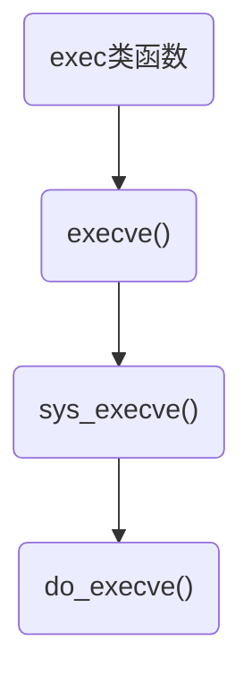
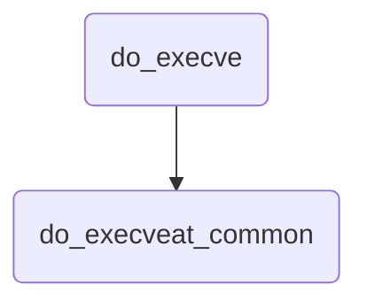

未完成

#### 简述

在Linux系统中提供了exec开头的一系列函数，这些函数能通过内核调用用户空间的程序，能**用可执行文件所描述的上下文代替进程的上下文**；这些函数都是以exec前缀开始的，这些exec函数都是调用execve()系统调用实现的；而在内核态的sys_execve()函数，是调用do_execve()函数实现的；

<!--more-->




内核中实际执行execv()或execve()系统调用的是do_execve()函数；而do_execve()函数进一步通过do_execveat_common()函数


do_execve()函数在fs/exec.c文件中定义；


```c
// fs/exec.c
int do_execve(struct filename *filename,
    const char __user *const __user *__argv,
    const char __user *const __user *__envp)
{
    struct user_arg_ptr argv = { .ptr.native = __argv };
    struct user_arg_ptr envp = { .ptr.native = __envp };
    return do_execveat_common(AT_FDCWD, filename, argv, envp, 0);
}
```





#### 参数

do_execve()函数的参数：

| 参数     | 类型                                | 描述                 |
| -------- | ----------------------------------- | -------------------- |
| filename | struct filename                     | 可执行程序的名称信息 |
| __argv   | const char \_\_user *const __user * | 可执行程序的参数信息 |
| __envp   | const char \_\_user *const __user * | 环境变量信息         |


```c
// include/linux/fs.h
struct filename {
    const char      *name;  /* pointer to actual string */
    const __user char   *uptr;  /* original userland pointer */
    struct audit_names  *aname;
    int         refcnt;
    const char      iname[];
};
```


```c
// fs/exec.c
static int do_execveat_common(int fd, struct filename *filename,
                  struct user_arg_ptr argv,
                  struct user_arg_ptr envp,
                  int flags)
{
    char *pathbuf = NULL;
    struct linux_binprm *bprm;
    struct file *file;
    struct files_struct *displaced;
    int retval;

    if (IS_ERR(filename)) {
        printk("%s, %d, filename error\n", __func__, __LINE__);
        return PTR_ERR(filename);
    }

    /*
     * We move the actual failure in case of RLIMIT_NPROC excess from
     * set*uid() to execve() because too many poorly written programs
     * don't check setuid() return code.  Here we additionally recheck
     * whether NPROC limit is still exceeded.
     */
    if ((current->flags & PF_NPROC_EXCEEDED) &&
        atomic_read(&current_user()->processes) > rlimit(RLIMIT_NPROC)) {
        retval = -EAGAIN;
        goto out_ret;
    }

    /* We're below the limit (still or again), so we don't want to make
     * further execve() calls fail. */
    current->flags &= ~PF_NPROC_EXCEEDED;

    // 调用unshare_files()为进程复制一份文件表
    retval = unshare_files(&displaced);
    if (retval)
        goto out_ret;

    retval = -ENOMEM;
    // 调用kzalloc()在堆上分配一份structlinux_binprm结构体
    bprm = kzalloc(sizeof(*bprm), GFP_KERNEL);
    if (!bprm)
        goto out_files;

    retval = prepare_bprm_creds(bprm);
    if (retval)
        goto out_free;

    check_unsafe_exec(bprm);
    current->in_execve = 1;

    // 调用do_open_execat()查找并打开二进制文件
    file = do_open_execat(fd, filename, flags);
    retval = PTR_ERR(file);
    if (IS_ERR(file)) {
        printk("%s, %d, file error\n", __func__, __LINE__);
        goto out_unmark;
    }

    // 调用sched_exec()找到最小负载的CPU，用来执行该二进制文件
    sched_exec();

    // 根据获取的信息，填充struct linux_binprm结构体中的file、filename、interp成员
    bprm->file = file;
    if (fd == AT_FDCWD || filename->name[0] == '/') {
        bprm->filename = filename->name;
    } else {
        if (filename->name[0] == '\0')
            pathbuf = kasprintf(GFP_TEMPORARY, "/dev/fd/%d", fd);
        else
            pathbuf = kasprintf(GFP_TEMPORARY, "/dev/fd/%d/%s",
                        fd, filename->name);
        if (!pathbuf) {
            retval = -ENOMEM;
            goto out_unmark;
        }
        /*
         * Record that a name derived from an O_CLOEXEC fd will be
         * inaccessible after exec. Relies on having exclusive access to
         * current->files (due to unshare_files above).
         */
        if (close_on_exec(fd, rcu_dereference_raw(current->files->fdt)))
            bprm->interp_flags |= BINPRM_FLAGS_PATH_INACCESSIBLE;
        bprm->filename = pathbuf;
    }

    bprm->interp = bprm->filename;

    // 调用bprm_mm_init()创建进程的内存地址空间，并调用init_new_context()检查当前进程是否使用自定义的局部描述符表；如果是，那么分配和准备一个新的LDT；
    retval = bprm_mm_init(bprm);
    if (retval)
        goto out_unmark;

    // 填充struct linux_binprm结构体中的命令行参数argv,环境变量envp
    bprm->argc = count(argv, MAX_ARG_STRINGS);
    if ((retval = bprm->argc) < 0)
        goto out;

    bprm->envc = count(envp, MAX_ARG_STRINGS);
    if ((retval = bprm->envc) < 0)
        goto out;

    // 调用prepare_binprm()检查该二进制文件的可执行权限；最后，kernel_read()读取二进制文件的头128字节（这些字节用于识别二进制文件的格式及其他信息，后续会使用到）
    retval = prepare_binprm(bprm);
    if (retval < 0)
        goto out;

    // 调用copy_strings_kernel()从内核空间获取二进制文件的路径名称
    retval = copy_strings_kernel(1, &bprm->filename, bprm);
    if (retval < 0)
        goto out;

    bprm->exec = bprm->p;
    // 调用copy_string()从用户空间拷贝环境变量
    retval = copy_strings(bprm->envc, envp, bprm);
    if (retval < 0)
        goto out;

    // 调用copy_string()从用户空间拷贝命令行参数
    retval = copy_strings(bprm->argc, argv, bprm);
    if (retval < 0)
        goto out;

    would_dump(bprm, bprm->file);

    // 至此，二进制文件已经被打开，struct linux_binprm结构体中也记录了重要信息；下面需要识别该二进制文件的格式并最终运行该文件；
    retval = exec_binprm(bprm);
    if (retval < 0)
        goto out;

    /* execve succeeded */
    current->fs->in_exec = 0;
    current->in_execve = 0;
    acct_update_integrals(current);
    task_numa_free(current);
    free_bprm(bprm);
    kfree(pathbuf);
    putname(filename);
    if (displaced)
        put_files_struct(displaced);
    return retval;

out:
    if (bprm->mm) {
        acct_arg_size(bprm, 0);
        mmput(bprm->mm);
    }

out_unmark:
    current->fs->in_exec = 0;
    current->in_execve = 0;

out_free:
    free_bprm(bprm);
    kfree(pathbuf);

out_files:
    if (displaced)
        reset_files_struct(displaced);
out_ret:
    putname(filename);
    return retval;
}
```


#### 参考资料


https://blog.csdn.net/gatieme/article/details/51594439


