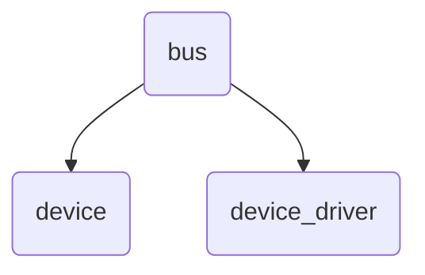
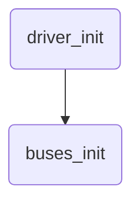

未完成

Linux设备驱动模型，由总线（bus）、设备（device）、驱动（driver）三部分组成；总线是处理器与设备之间的通道，在设备模型中，所有的设备都通过总线相连；总线作为Linux设备驱动模型的核心架构，系统中的设备和驱动都挂接在相应的总线上，来完成各自的工作；

<!--more-->


#### 目录


[TOC]


#### 0. 简介

Linux设备驱动模型，由总线（bus）、设备（device）、驱动（driver）三部分组成；总线是处理器与设备之间的通道，在设备模型中，所有的设备都通过总线相连；总线作为Linux设备驱动模型的核心架构，系统中的设备和驱动都挂接在相应的总线上，来完成各自的工作；


Linux设备驱动模型中的总线，既可以是实际物理总线的抽象（如：PCI总线、I2C总线、USB总线），也可以是虚拟总线，一个符合Linux设备驱动模型的设备和驱动都必须挂接在一根总线上，无论是实际存在的总线还是系统模拟的总线；


Linux设备模型中，最底层每一个设备都用一个device结构的实例来表示；而驱动是使总线上的设备能够完成一些功能；系统中有很多种总线，如：PCI总线、I2C总线、USB总线、scsi总线等；


buses_init()函数在sysfs文件系统的根目录下建立一个bus目录，即/sys/bus，是系统中后续注册总线的连接点；


Linux设备模型中一组很重要的概念：总线、设备、驱动，即：bus、device、driver；分别对应数据结构struct bus_type，struct device，struct device_driver；

| 名称 | 类型   | 对应的数据结构       | 代码文件              |
| ---- | ------ | -------------------- | --------------------- |
| 总线 | bus    | struct bus_type      | drivers/base/bus.c    |
| 设备 | device | struct device        | drivers/base/core.c   |
| 驱动 | driver | struct device_driver | drivers/base/driver.c |





Linux设备驱动模型中，总线、设备、驱动都有对于的属性信息；

| 类型   | 属性数据结构     | 设置属性方法             |
| ------ | ---------------- | ------------------------ |
| bus    | bus_attribute    | BUS_ATTR()               |
| device | device_attribute | DEVICE_ATTR()            |
| driver | driver_attribute | 手动设置driver_attribute |


Linux系统在启动时的初始化阶段，通过在driver_init()中调用buses_init()函数，完成所有总线的最初操作，创建出bus的祖先；





```c
// drivers/base/bus.c
static struct kset *bus_kset;
int __init buses_init(void)
{
    bus_kset = kset_create_and_add("bus", &bus_uevent_ops, NULL);
    system_kset = kset_create_and_add("system", NULL, &devices_kset->kobj);

    return 0;
}
```


buses_init()函数创建一个名为"bus"的kset，并将其加入到sysfs文件系统树中，在sysfs中的根目录创建bus，即/sys/bus目录；


#### 1. 总线(bus)


内核用struct bus_type结构体来描述总线信息；


```c
// include/linux/device.h
struct bus_type {
    const char      *name;	// 总线名称，在/sys/bus下出现
    const char      *dev_name;
    const struct attribute_group **bus_groups;
    const struct attribute_group **dev_groups;
    const struct attribute_group **drv_groups;
	......
    int (*match)(struct device *dev, struct device_driver *drv);
    int (*uevent)(struct device *dev, struct kobj_uevent_env *env);
    int (*probe)(struct device *dev);
    int (*remove)(struct device *dev);
    void (*shutdown)(struct device *dev);
	......
    struct subsys_private *p;	// 用来管理bus中设备和驱动关系的结构体
};
```


总线用struct subsys_private结构体来管理总线中设备和驱动的关系；


```c
drivers/base/base.h
struct subsys_private {
    struct kset subsys;		// 表示bus所在的子系统
    struct kset *devices_kset;		// 表示bus上所有设备的集合
    struct list_head interfaces;
    struct mutex mutex;

    struct kset *drivers_kset;		// 表示bus上所有驱动的集合
    struct klist klist_devices;		// 表示bus上所有设备的链表
    struct klist klist_drivers;		// 表示bus上所有驱动的链表
    struct blocking_notifier_head bus_notifier;
    unsigned int drivers_autoprobe:1;
    struct bus_type *bus;

    struct kset glue_dirs;
    struct class *class;
};
```


struct kset subsys：表示bus所在的子系统


unsigned int drivers_autoprobe:1  表示向系统总线中注册设备或驱动时，是否进行设备和驱动的绑定操作；


struct kset *devices_kset和struct kset *drivers_kset分别表示bus上所有设备和驱动的集合；是在向系统注册当前新总线时动态生成的容纳该总线上所有驱动和设备的kset；


struct klist klist_devices和struct klist klist_drivers分别表示该总线上所有设备和驱动的链表；两个klist成员以链表的形式将该总线上所有的驱动与设备链接到一起；总线、设备、驱动的关系如下图所示：


##### 1.1 总线的注册


```c
// drivers/base/bus.c
int bus_register(struct bus_type *bus);
```


bus_register()函数用来注册一个bus总线子系统，可能会失败，必须检查返回值；注册成功后，可以在/sys/bus/目录下看到该总线；之后就可以向总线中添加设备了；


```c
// drivers/base/bus.c
int bus_register(struct bus_type *bus)
{
    struct subsys_private *priv;

    priv = kzalloc(sizeof(struct subsys_private), GFP_KERNEL);
    priv->bus = bus;
    bus->p = priv;

    BLOCKING_INIT_NOTIFIER_HEAD(&priv->bus_notifier);

    retval = kobject_set_name(&priv->subsys.kobj, "%s", bus->name);	// 为bus设定名字

    priv->subsys.kobj.kset = bus_kset;
    priv->subsys.kobj.ktype = &bus_ktype;
    priv->drivers_autoprobe = 1;
    retval = kset_register(&priv->subsys);	// 在/sys/bus目录下为当前注册的bus生成目录

    retval = bus_create_file(bus, &bus_attr_uevent);	// 生成bus的属性文件
    priv->devices_kset = kset_create_and_add("devices", NULL,
                         &priv->subsys.kobj);	// 为bus生成容纳设备的kset容器
    priv->drivers_kset = kset_create_and_add("drivers", NULL,
                         &priv->subsys.kobj);	// // 为bus生成容纳驱动的kset容器

    klist_init(&priv->klist_devices, klist_devices_get, klist_devices_put);
    klist_init(&priv->klist_drivers, NULL, NULL);	// 初始化bus上的设备和驱动链表

    retval = add_probe_files(bus);	// 为bus增加probe相关的属性文件
    retval = bus_add_groups(bus, bus->bus_groups);

    return 0;
}
EXPORT_SYMBOL_GPL(bus_register); 
```


bus_register()函数，分配一个subsys_private结构体，通过kobject_set_name()函数为bus所在的内核对象设定名称，该名称在sysfs文件系统树中显示，再完成对subsys_private结构体成员参数的初始化操作，同时在创建了devices和drivers两个属性文件夹，/sys/bus/devices和/sys/bus/drivers；


kset_register()函数将当前操作的bus所对应的kset加入到sysfs文件系统树中；


bus_create_file()函数为bus创建一个属性文件；


kset_create_and_add()函数生成一个kset对象，并将其加入到sysfs文件系统树中；parent参数为&priv->subsys.kobj，将在当前正在向系统注册的新bus目录下生成两个kset目录，对应新bus的devices和drivers，即/sys/bus/bus_name/devices和/sys/bus/bus_name/drivers；


举例：通过bus_register()函数注册一个新的bus1总线，如下图所示：


图中虚线部分，是将bus1总线通过bus_register()函数注册进系统时的层次结构：


首先生成一个表示bus1的kset对象，并加入到sysfs文件系统中，该kset的parent内核对象为buses_init()函数中产生的bus_kset；


其次，bus_register()函数，通过kset_create_and_add()函数，生成连接到bus1总线上的devices_kset和drivers_kset的集合，对应在sysfs系统中，会在/sys/bus/bus1目录下生成devices和drivers两个目录；


最后，bus_register()函数，通过bus_create_file()函数，为bus1总线在/sys/bus/bus1目录下生成一些属性文件；


属性文件实际上向用户空间提供了一些接口，用户程序可以通过这些属性文件获取或者设置属性内核对象的属性；


##### 1.2 总线的注销


```c
// drivers/base/bus.c
void bus_unregister(struct bus_type *bus);
```


```c
// drivers/base/bus.c
void bus_unregister(struct bus_type *bus)
{
    pr_debug("bus: '%s': unregistering\n", bus->name);
    if (bus->dev_root)
        device_unregister(bus->dev_root);
    bus_remove_groups(bus, bus->bus_groups);
    remove_probe_files(bus);
    kset_unregister(bus->p->drivers_kset);
    kset_unregister(bus->p->devices_kset);
    bus_remove_file(bus, &bus_attr_uevent);
    kset_unregister(&bus->p->subsys);
}
EXPORT_SYMBOL_GPL(bus_unregister);
```


##### 1.3 总线方法


在struct bus_type结构体中定义了一些方法；


```c
int (*match)(struct device *dev, struct device_driver *drv);
```


match方法：当总线上添加新设备或新驱动程序时，会多次调用match方法，将device和device_driver进行匹配，如果匹配成功，说明指定的驱动程序能够处理指定的设备，match方法返回非零值；


创建一个名为ldd的虚拟总线为例；


```c
struct bus_type ldd_bus_type = {
    .name = "ldd",
    .match = ldd_match,
};
```


```c
ret = bus_register(&ldd_bus_type);
if (ret) {
    printk("%s, bus_register failed\n", __func__);
    return -1;
}
```


```c
bus_unregister(&ldd_bus_type);
```


在lddbus中添加一个简单的match方法，只是简单地比较设备和驱动程序的名字；在真实的总线驱动中，match方法可能会进行更加复杂的比较；


```c
int ldd_match(struct device *dev, struct device_driver *drv)
{
    return (strcmp(dev->kobj.name, drv->name) == 0);
}
```


验证


```c
# lsmod
ldd_bus 16384 0 - Live 0xffff000000c90000 (O)
```


```c
# ls /sys/bus/ldd/
devices            drivers_autoprobe  uevent
drivers            drivers_probe
```


##### 1.4 总线属性


总线属性表示该总线的特有信息和配置，通过sysfs文件系统为总线生成属性文件，用户空间可以通过该属性文件接口，获取或者设置总线的属性；


总线属性用struct bus_attribute结构体表示；


```c
// include/linux/device.h
struct bus_attribute {
    struct attribute    attr;
    ssize_t (*show)(struct bus_type *bus, char *buf);
    ssize_t (*store)(struct bus_type *bus, const char *buf, size_t count);
};
```


show和store用来获取和设置总线的属性信息；


```c
// include/linux/sysfs.h
struct attribute {
    const char      *name;
    umode_t         mode;
};
```


为总线定义属性可以使用BUS_ATTR()宏定义；


```c
// include/linux/device.h
#define BUS_ATTR(_name, _mode, _show, _store)   \
    struct bus_attribute bus_attr_##_name = __ATTR(_name, _mode, _show, _store)
```


```c
// include/linux/sysfs.h
#define __ATTR(_name, _mode, _show, _store) {               \
    .attr = {.name = __stringify(_name),                \
    .mode = VERIFY_OCTAL_PERMISSIONS(_mode) },     \
    .show   = _show,                        \
    .store  = _store,                       \
}
```


BUS_ATTR()宏，定义一个以bus_attr_开头的总线属性，生成总线属性文件需要使用bus_create_file()函数来完成；


```c
// drivers/base/bus.c
int bus_create_file(struct bus_type *bus, struct bus_attribute *attr)
{
    int error;

    if (bus_get(bus)) {
        error = sysfs_create_file(&bus->p->subsys.kobj, &attr->attr);
        bus_put(bus);
    } else
        error = -EINVAL;
    return error;
}
EXPORT_SYMBOL_GPL(bus_create_file);
```


```c
// drivers/base/bus.c
static BUS_ATTR(drivers_autoprobe, S_IWUSR | S_IRUGO,
        show_drivers_autoprobe, store_drivers_autoprobe);

static ssize_t show_drivers_autoprobe(struct bus_type *bus, char *buf)
{
    return sprintf(buf, "%d\n", bus->p->drivers_autoprobe);
}

static ssize_t store_drivers_autoprobe(struct bus_type *bus,
                       const char *buf, size_t count)
{
    if (buf[0] == '0')
        bus->p->drivers_autoprobe = 0;
    else
        bus->p->drivers_autoprobe = 1;
    return count;
}
```


自己实现一个属性文件如下：


```c
ssize_t ldd_show_bus_version(struct bus_type *bus, char *buf)
{
    return snprintf(buf, PAGE_SIZE, "%s\n", VERSION);
}

BUS_ATTR(version, S_IRUGO, ldd_show_bus_version, NULL);
ret = bus_create_file(&ldd_bus_type, &bus_attr_version);
```


之后可以看到/sys/bus/ldd/version属性；


#### 2. 设备(device)


设备代表真实的具体的物理器件，


总线实际上也是一个设备，因此也要以设备形式被单独注册；这个ldd总线是一个顶层总线，因此parent和bus成员是NULL，总线名字是ldd；


```c
// include/linux/device.h
struct device {
    struct device       *parent;
    struct device_private   *p;
    struct kobject kobj;
    const char      *init_name; /* initial name of the device */
    const struct device_type *type;
    struct bus_type *bus;       /* type of bus device is on */
    struct device_driver *driver;   /* which driver has allocated this device */
    void        *driver_data;   /* Driver data, set and get with
                       dev_set/get_drvdata */
    struct device_node  *of_node; /* associated device tree node */
    void    (*release)(struct device *dev);
    ......
};
```


##### 2.1 设备注册


```c
// drivers/base/core.c
int device_register(struct device *dev)
{
    device_initialize(dev);		// 初始化device
    return device_add(dev);		// 将device添加到系统中
}
EXPORT_SYMBOL_GPL(device_register);
```


device_register()函数用来注册设备，可能会失败，必须检查返回值；注册成功后，可以在/sys/devices目录下看到该设备；以后添加到改总线上的任何设备都可以在/sys/devices/ldd目录下显示；


创建一个名为ldd的设备为例；


```c
struct device ldd_bus_dev = {
    .init_name = "ldd",
};
```


```c
ret = device_register(&ldd_bus_dev);
if (ret) {
    printk("%s, device_register failed\n", __func__);
    return -1;
}
```


##### 2.2 设备注销


```c
// drivers/base/core.c
void device_unregister(struct device *dev)
{
    pr_debug("device: '%s': %s\n", dev_name(dev), __func__);
    device_del(dev);	// 从子系统中删除
    put_device(dev);	// 减少引用计数
}
EXPORT_SYMBOL_GPL(device_unregister);
```


用法：


```c
device_unregister(&ldd_bus_dev);
```


##### 2.3 设备属性


```c
// include/linux/device.h
struct device_attribute {
    struct attribute    attr;
    ssize_t (*show)(struct device *dev, struct device_attribute *attr,
            char *buf);
    ssize_t (*store)(struct device *dev, struct device_attribute *attr,
             const char *buf, size_t count);
};
```


```c
// include/linux/device.h
#define DEVICE_ATTR(_name, _mode, _show, _store) \
    struct device_attribute dev_attr_##_name = __ATTR(_name, _mode, _show, _store)
```


```c
// include/linux/sysfs.h
#define __ATTR(_name, _mode, _show, _store) {               \
    .attr = {.name = __stringify(_name),                \
    .mode = VERIFY_OCTAL_PERMISSIONS(_mode) },     \
    .show   = _show,                        \
    .store  = _store,                       \
}
```


```c
// drivers/base/core.c
int device_create_file(struct device *dev,
                       const struct device_attribute *attr);
void device_remove_file(struct device *dev,
                        const struct device_attribute *attr);
```


##### 2.4 设备结构的封装


在device结构体中已经包含了设备模型核心，用来模拟系统的信息；对于大多数系统来说，还需要包含一些系统其它的信息，因此需要对封装一个ldd_device，包含device结构体以及其它一些重要的信息；在ldd总线的每一个设备都需要使用ldd_device结构体来抽象；


```c
struct ldd_device {
    char *name;
    struct ldd_driver *driver;
    struct device dev;
};

#define to_ldd_device(dev)  (container_of((dev), struct ldd_device, dev))
```


ldd_device结构体可以作为ldd总线上设备的一个抽象，包含一个device结构体，一个指向驱动程序的结构体指针；还可以根据需要添加信息，如：供应商信息、设备模型、设备配置、使用的资源等；


to_ldd_device()宏定义，用来方便地用device结构体找到ldd_device结构体；


ldd总线下的设备注册功能可以使用以下封装的ldd_device_register()函数来实现；


```c
int ldd_device_register(struct ldd_device *ldddev)
{
    ldddev->dev.bus = &ldd_bus_type;
    ldddev->dev.parent = &ldd_bus;
    ldddev->dev.release = ldd_dev_release;
    strncpy(ldddev->dev.kobj.name, ldddev->name, strlen(ldddev->name) + 1);

    return device_register(&ldddev->dev);
}
EXPORT_SYMBOL(ldd_device_register);
```


ldd_device_register()函数简单地初始化了ldd_device结构体中的device结构体成员，并向驱动程序核心注册该device结构体设备；


##### 2.5 举例


#### 3. 设备驱动(device_driver)


设备驱动用device_driver结构体来表示：


```c
// include/linux/device.h
struct device_driver {
    const char      *name;	// 驱动程序的名字
    struct bus_type     *bus;

    const struct of_device_id   *of_match_table;
    const struct acpi_device_id *acpi_match_table;

    int (*probe) (struct device *dev);
    int (*remove) (struct device *dev);
	......
    struct driver_private *p;
};
```


name：驱动程序的名字，会显示在sysfs中


bus：该驱动程序的总线类型


##### 3.1 设备驱动注册


```c
// drivers/base/driver.c
int driver_register(struct device_driver *drv);
```


##### 3.2 设备驱动注销


```c
// drivers/base/driver.c
void driver_unregister(struct device_driver *drv);
```


##### 3.3 设备驱动属性


```c
// include/linux/device.h
struct driver_attribute {
    struct attribute attr;
    ssize_t (*show)(struct device_driver *driver, char *buf);
    ssize_t (*store)(struct device_driver *driver, const char *buf,
             size_t count);
};

#define DRIVER_ATTR(_name, _mode, _show, _store) \
    struct driver_attribute driver_attr_##_name = __ATTR(_name, _mode, _show, _store)

// include/linux/sysfs.h
#define __ATTR(_name, _mode, _show, _store) {               \
    .attr = {.name = __stringify(_name),                \
    .mode = VERIFY_OCTAL_PERMISSIONS(_mode) },     \
    .show   = _show,                        \
    .store  = _store,                       \
}
```


属性文件的创建和删除：


```c
// drivers/base/driver.c
int driver_create_file(struct device_driver *drv,
               const struct driver_attribute *attr);
void driver_remove_file(struct device_driver *drv,
            const struct driver_attribute *attr);
```


##### 3.4 驱动程序结构的封装


对于大多数驱动程序来说，device_driver结构通常被包含在高层和总线相关的结构中，因此对于ldd子系统需要定义一个ldd_driver结构，包含device_driver结构体和一些需要的信息；在ldd总线的每一个驱动都需要使用ldd_driver结构体来抽象；


```c
struct ldd_driver {
    char *version;
    struct module *module;
    struct device_driver driver;
    struct driver_attribute version_attr;
};

#define to_ldd_driver(drv)  (container_of((drv), struct ldd_driver, driver))
```


ldd_driver结构体可以作为ldd总线上设备驱动的一个抽象，包含一个device_driver结构体；还可以根据需要添加一些别的信息；


to_ldd_driver()宏定义，用来方便地用device_driver结构体找到ldd_driver结构体；


ldd总线下的设备驱动注册功能可以使用以下封装的ldd_driver_register()函数来实现；


```c
int ldd_driver_register(struct ldd_driver *driver)
{
    int ret = -1;

    driver->driver.bus = &ldd_bus_type;
    ret = driver_register(&driver->driver);
    if (ret) {
        printk("%s, driver_register failed\n", __func__);
        return ret;
    }
    driver->version_attr.attr.name = "version";
    driver->version_attr.attr.mode = S_IRUGO;
    driver->version_attr.show = show_version;
    driver->version_attr.store = NULL;

    return driver_create_file(&driver->driver, &driver->version_attr);
}
EXPORT_SYMBOL(ldd_driver_register);
```


ldd_driver_register()函数简单地初始化了ldd_driver结构体中的device_driver结构体成员，并向驱动程序核心注册该device_driver结构体设备驱动，同时还设置了驱动的版本号属性信息；因为驱动的版本号信息是在系统运行时建立的，所以必须手动设置driver_attribute结构体，而不能使用DRIVER_ATTR()宏；


```c
static ssize_t show_version(struct device_driver *driver, char *buf)
{
    struct ldd_driver *ldd_drv = to_ldd_driver(driver);

    sprintf(buf, "%s\n", ldd_drv->version);
    return strlen(buf);
}
```


##### 3.5 举例


#### 4. 实例


驱动工程师在驱动开发过程中，都是使用内核中已经封装好的总线，以及设备驱动模型接口，很少会需要添加一条总线，本节为了验证创建总线的过程，创建一条简单的总线ldd，用做测试；


##### 4.1 注册总线 


```c
int ldd_bus_init(void)
{
    int ret = -1;

    ret = bus_register(&ldd_bus_type);
    if (ret) {
        printk("%s, bus_register failed\n", __func__);
        return -1;
    }

    ret = bus_create_file(&ldd_bus_type, &bus_attr_version);
    if (ret) {
        printk("%s, bus_create_file failed\n", __func__);
        return -1;
    }

    ret = device_register(&ldd_bus_dev);
    if (ret) {
        printk("%s, device_register failed\n", __func__);
        return -1;
    }

    return 0;
}

void ldd_bus_exit(void)
{
    device_unregister(&ldd_bus_dev);
    bus_remove_file(&ldd_bus_type, &bus_attr_version);
    bus_unregister(&ldd_bus_type);
}

module_init(ldd_bus_init);
module_exit(ldd_bus_exit);
MODULE_LICENSE("GPL");
```


```c
ssize_t ldd_show_bus_version(struct bus_type *bus, char *buf)
{
    return snprintf(buf, PAGE_SIZE, "%s\n", VERSION);
}

BUS_ATTR(version, S_IRUGO, ldd_show_bus_version, NULL);

struct device ldd_bus_dev = {
    .init_name = "ldd",
};

int ldd_match(struct device *dev, struct device_driver *drv)
{
    return (strcmp(dev->kobj.name, drv->name) == 0);
}

struct bus_type ldd_bus_type = {
    .name = "ldd",
    .match = ldd_match,
};
EXPORT_SYMBOL(ldd_bus_type);
```


##### 4.2 封装设备接口


```c
//===================================

void ldd_bus_release(struct device *dev)
{
    printk("%s, %d\n", __func__, __LINE__);
}

struct device ldd_bus = {
    .init_name = "ldd",
    .release = ldd_bus_release,
};

struct ldd_device {
    char *name;
    struct ldd_driver *driver;
    struct device dev;
};

#define to_ldd_device(dev)  (container_of((dev), struct ldd_device, dev))

void ldd_dev_release(struct device *dev)
{
    printk("%s, %d\n", __func__, __LINE__);
}

int ldd_device_register(struct ldd_device *ldddev)
{
    ldddev->dev.bus = &ldd_bus_type;
    ldddev->dev.parent = &ldd_bus;
    ldddev->dev.release = ldd_dev_release;
    strncpy(ldddev->dev.kobj.name, ldddev->name, strlen(ldddev->name) + 1);

    return device_register(&ldddev->dev);
}
EXPORT_SYMBOL(ldd_device_register);

//===================================
```


##### 4.3 封装驱动接口


```c
struct ldd_driver {
    char *version;
    struct module *module;
    struct device_driver driver;
    struct driver_attribute version_attr;
};

#define to_ldd_driver(drv)  (container_of((drv), struct ldd_driver, driver))

static ssize_t show_version(struct device_driver *driver, char *buf)
{
    struct ldd_driver *ldd_drv = to_ldd_driver(driver);

    sprintf(buf, "%s\n", ldd_drv->version);
    return strlen(buf);
}

int ldd_driver_register(struct ldd_driver *driver)
{
    int ret = -1;

    driver->driver.bus = &ldd_bus_type;
    ret = driver_register(&driver->driver);
    if (ret) {
        printk("%s, driver_register failed\n", __func__);
        return ret;
    }
    driver->version_attr.attr.name = "version";
    //driver->version_attr.attr.owner = driver->module;
    driver->version_attr.attr.mode = S_IRUGO;
    driver->version_attr.show = show_version;
    driver->version_attr.store = NULL;

    return driver_create_file(&driver->driver, &driver->version_attr);
}
EXPORT_SYMBOL(ldd_driver_register);
```


##### 4.4 添加设备和驱动


##### 4.5 测试


#### 5. 总结


#### 6. 参考资料


《Linux设备驱动程序》


《深入Linux设备驱动程序内核机制》


[回到目录](!目录)


