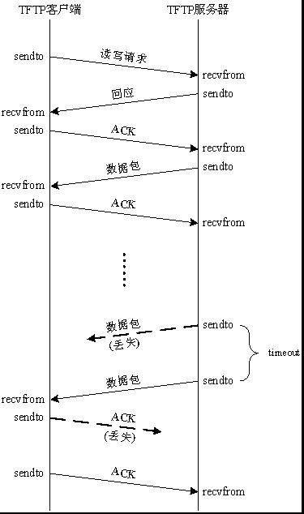

u-boot中的tftp命令，采用UDP协议，tftp服务器使用UDP 69号端口，传送的数据包最大为512字节，双方采用超时重传机制；


<!--more-->


#### tftp命令

命令：

```c
tftp Address FileName
    Address: 用来保存文件的地址
    FileName: 传送的文件名
```


应用举例：

```
=> setenv serverip 192.168.1.100
=> setenv ipaddr 192.168.1.110
```

tftp下载：

```
=> tftp 0xa0000000 kernel.bin
```

tftp上传：

```
=> tftp 0xa0000000 kernel.bin 0x10000000
```


u-boot中的bootcmd命令：

```
=> print bootcmd
bootcmd=tftp 0x60003000 uImage; tftp 0x60500000 vexpress-v2p-ca9.dtb;      setenv bootargs 'root=/dev/mmcblk0 rw       init=/linuxrc       ip=192.168.1.110 console=ttyAMA0';      bootm 0x60003000 - 0x60500000;
```

tftp下载过程：

```
smc911x: MAC **:**:**:**:**:**
smc911x: detected LAN9118 controller
smc911x: phy initialized
smc911x: MAC **:**:**:**:**:**
Using smc911x-0 device
TFTP from server 192.168.1.100; our IP address is 192.168.1.110
Filename 'uImage'.
Load address: 0x60003000
Loading: #################################################################
	 #################################################################
	 #################################################################
	 #############################################
	 7.6 MiB/s
done
Bytes transferred = 3512664 (359958 hex)

smc911x: MAC **:**:**:**:**:**
smc911x: MAC **:**:**:**:**:**
smc911x: detected LAN9118 controller
smc911x: phy initialized
smc911x: MAC **:**:**:**:**:**
Using smc911x-0 device
TFTP from server 192.168.1.100; our IP address is 192.168.1.110
Filename 'vexpress-v2p-ca9.dtb'.
Load address: 0x60500000
Loading: ##
	 4.7 MiB/s
done
Bytes transferred = 14772 (39b4 hex)
```


#### tftp参数

tftp需要的参数：

| 参数             |
| ---------------- |
| tftp_remote_ip   |
| net_ip           |
| net_netmask      |
| net_gateway      |
| tftp_filename    |
| tftp_state       |
| tftp_block_size  |
| timeout_ms       |
| time_count_max   |
| tftp_handler     |
| tftp_remote_port |
| tftp_our_port    |


在tftp下载时，会先设置好这些tftp参数，然后开始向tftp服务器发送请求命令；


#### tftp客户端状态

通过tftp_state变量来描述：

| 状态            | 说明             |
| --------------- | ---------------- |
| STATE_SEND_RRQ  | 发出读取请求     |
| STATE_DATA      | 正在接收数据     |
| STATE_TOO_LARGE | 文件太大         |
| STATE_BAD_MAGIC | Magic错误        |
| STATE_OACK      | 收到OACK应答     |
| STATE_RECV_WRQ  | 同STATE_DATA     |
| STATE_SEND_WRQ  | 同STATE_SEND_RRQ |


#### tftp数据包类型

| 类型       | 说明                                              |
| ---------- | ------------------------------------------------- |
| TFTP_RRQ   | 请求读取文件                                      |
| TFTP_WRQ   | 请求写文件                                        |
| TFTP_DATA  | 数据包                                            |
| TFTP_ACK   | 确认应答包                                        |
| TFTP_ERROR | 错误信息包                                        |
| TFTP_OACK  | 服务器超时未收到客户端的ACK时，主动发送一个OACK包 |


#### tftp主要的函数

tftp功能实现代码位于net/tftp.c

```c
static void tftp_send(void)
```

根据tftp_state变量的值，发送不同的tftp数据包；

```c
static inline int store_block(int block, uchar *src, unsigned int len)
```

根据load_addr地址，将src开始，长度为len的block个数据块写入flash或内存中；

```c
static void tftp_handler(uchar *pkt, unsigned dest, struct in_addr sip,
              unsigned src, unsigned len)
```

处理收到的tftp数据包的函数；

```c
static void tftp_timeout_handler(void)
```

超时处理函数；

```c
void tftp_start(enum proto_t protocol)
```

初始化各个tftp参数，并发送tftp读请求；


#### tftp下载流程

1. 首先，由客户端初始化各tftp参数，并发出读写请求；

2. 服务器收到请求并同意，打开连接，发送第一个数据包；

3. 客户端收到数据包后发回确认，服务器在发送下一个数据包前必须确认收到客户端对上一个数据包的确认；

4. 如果数据包在传输过程中丢失，服务器不会收到客户端的确认，服务器在超时后重新传输最后一个未被确认的数据包；

5. 发送的数据包为512字节，如果数据包小于512字节，则表示该数据包是最后一个；如果传输的数据是512字节的整数倍，最后会再发送一个空数据包；





